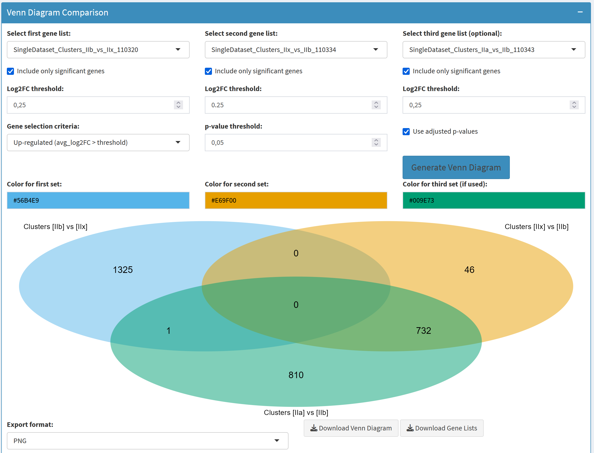
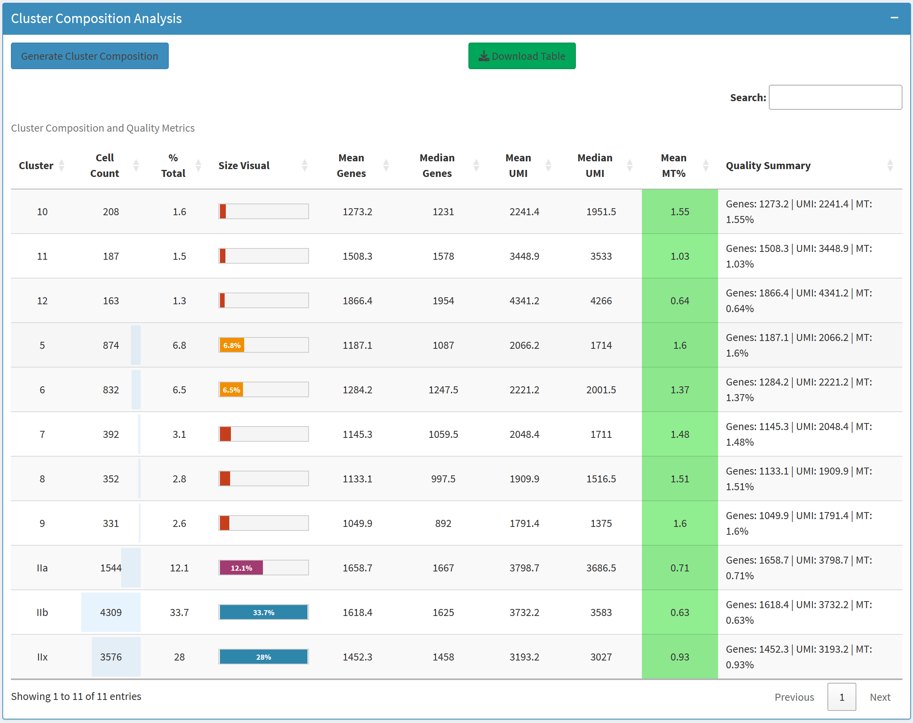
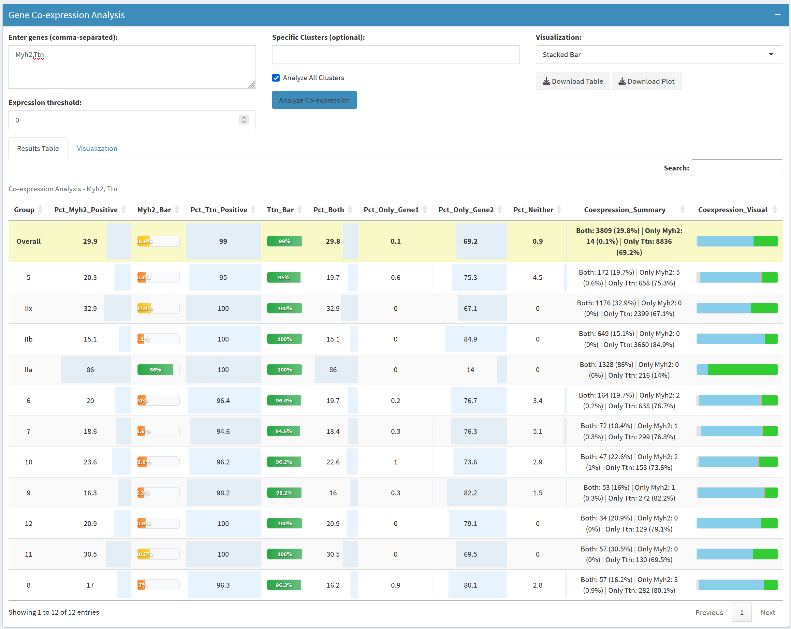

# Cluster Comparison

## Overview
This section identifies differentially expressed genes between clusters to understand what makes each cell population molecularly distinct. You can compare individual clusters against all others, compare specific clusters directly, and use advanced tools to analyze gene overlaps and co-expression patterns.

## What You'll Do on This Tab
- **Find genes that distinguish clusters** from each other
- **Compare specific cell populations** to identify their molecular differences
- **Analyze gene overlaps** between different comparisons using Venn diagrams
- **Examine cluster composition** and cell type distributions
- **Study gene co-expression patterns** within your dataset

## Analysis Pipeline

### Step 1: Global Comparison (One vs All Others)
**When to use**: Find genes that uniquely characterize a specific cluster


**How to set up**:
1. **Select target cluster** from "Target Cluster" dropdown
2. **Set Log2FC threshold**: Minimum fold-change required (default: 0.1)
   - Higher values = more stringent, fewer genes
   - Lower values = more permissive, more genes
3. **Set Min Expression %**: Minimum percentage of cells expressing the gene (default: 0.01)
   - Filters out very rarely expressed genes
4. **Choose number of genes** to display in results
5. **Click "Find Markers"** to run analysis

**What you get**: Genes that are significantly higher in your target cluster compared to all other clusters combined

### Step 2: Pairwise Comparison (Cluster vs Cluster)
**When to use**: Compare two specific clusters or groups of clusters directly

**How to set up**:
1. **Select Group 1 clusters**: Choose clusters for first comparison group
2. **Select Group 2 clusters**: Choose clusters for second comparison group
3. **Use same statistical parameters** as above
4. **Click "Compare Groups"** to run analysis


**What you get**: Genes that differ between your two selected groups

## Understanding Differential Expression Results

### Results Table Columns Explained
**Gene**: Name of the differentially expressed gene (clickable links to protein databases)

**avg_log2FC (Average Log2 Fold Change)**:
- Positive values = gene is higher in target cluster/group
- Negative values = gene is lower in target cluster/group  
- Magnitude indicates strength of difference (>1 = strong, 0.25-1 = moderate)

**pct.1**: Percentage of cells expressing the gene in your target cluster/group
- Higher values = more cells express this gene in your target

**pct.2**: Percentage of cells expressing the gene in comparison group
- Lower values = fewer comparison cells express this gene

**p_val**: Raw statistical significance value
- Lower values = more statistically significant

**p_val_adj**: Adjusted p-value (corrected for multiple testing)
- Use this for determining significance (typically < 0.05)

### Interpreting Good Biomarkers
**Excellent markers**: High avg_log2FC + High pct.1 + Low pct.2 + Low p_val_adj
**Example**: avg_log2FC = 2.1, pct.1 = 85%, pct.2 = 5%, p_val_adj = 1e-50

**Moderate markers**: Moderate avg_log2FC + Moderate pct.1 + Variable pct.2
**Example**: avg_log2FC = 0.8, pct.1 = 60%, pct.2 = 25%, p_val_adj = 0.01

### Step 3: Venn Diagram Analysis
**When to use**: Compare gene lists from multiple differential expression analyses



**How to set up**:
1. **Select gene lists**: Choose up to 3 previously generated comparison results
2. **Set filtering criteria** for each list:
   - Include only significant genes (recommended)
   - Set Log2FC thresholds
   - Choose gene direction (up-regulated, down-regulated, or both)
3. **Set p-value threshold**: Usually 0.05
4. **Choose colors** for each gene set
5. **Click "Generate Venn Diagram"**

**What you get**: 
- Visual overlap between different gene lists
- Tables showing genes unique to each comparison
- Genes shared between multiple comparisons

### Step 4: Cluster Composition Analysis
**When to use**: Get quantitative overview of your cluster sizes and distributions



**How to set up**:
1. **Click "Generate Cluster Composition"** 
2. **Review the table** showing:
   - Number of cells per cluster
   - Percentage of total cells
   - Visual size bars for easy comparison

**What you get**: Comprehensive overview of cluster sizes to understand dataset composition

### Step 5: Gene Co-expression Analysis
**When to use**: Examine how multiple genes are expressed together across clusters



**How to set up**:
1. **Enter genes** of interest (comma-separated)
2. **Set expression threshold**: Minimum level to count as "expressing"
3. **Choose specific clusters** or analyze all clusters
4. **Click "Analyze Co-expression"**

**What you get**:
- Table showing co-expression patterns
- Visualization of expression combinations
- Identification of cells expressing multiple markers simultaneously

```{tip}
Start with global comparisons to identify obvious cluster markers, then use pairwise comparisons to distinguish between similar clusters. Use Venn diagrams to find core signatures shared across related analyses.
```

## Recommended Analysis Workflow

### Phase 1: Initial Discovery
1. **Run global comparisons** for each major cluster
2. **Identify obvious cell type markers** (high fold-change, cluster-specific)
3. **Validate findings** with known marker genes from literature

### Phase 2: Detailed Comparison
1. **Compare similar clusters** using pairwise analysis
2. **Focus on clusters** that are difficult to distinguish
3. **Look for subtle but consistent differences**

### Phase 3: Integration Analysis
1. **Use Venn diagrams** to find shared signatures between related clusters
2. **Analyze cluster composition** to understand population sizes
3. **Examine co-expression** of key marker combinations

### Phase 4: Validation and Export
1. **Download gene lists** for pathway analysis
2. **Validate key findings** using expression visualization
3. **Document marker genes** for each cluster annotation

```{warning}
Statistical significance doesn't always mean biological relevance. Always validate important markers with expression plots and literature knowledge. Consider both fold-change magnitude and expression specificity.
```

## Export and Documentation

**Available Downloads**:
- **CSV files**: Complete differential expression results with all statistics
- **Gene lists**: From Venn diagram overlaps for pathway analysis
- **Cluster composition**: Table with cell counts and percentages
- **Co-expression results**: Detailed co-expression patterns

## Troubleshooting

**No significant genes found?**
- Lower the Log2FC threshold
- Check if clusters are truly different
- Ensure adequate cell numbers in each cluster

**Too many genes in results?**
- Increase Log2FC threshold
- Increase minimum expression percentage
- Focus on most significant genes (lowest p-values)

**Unexpected marker genes?**
- Validate with expression plots
- Check for batch effects or technical artifacts
- Cross-reference with known biology

## Next Steps

After identifying cluster biomarkers:
- Use gene lists for pathway enrichment analysis
- Validate key markers with additional datasets
- Use markers to refine cluster annotations
- Consider trajectory analysis for related clusters