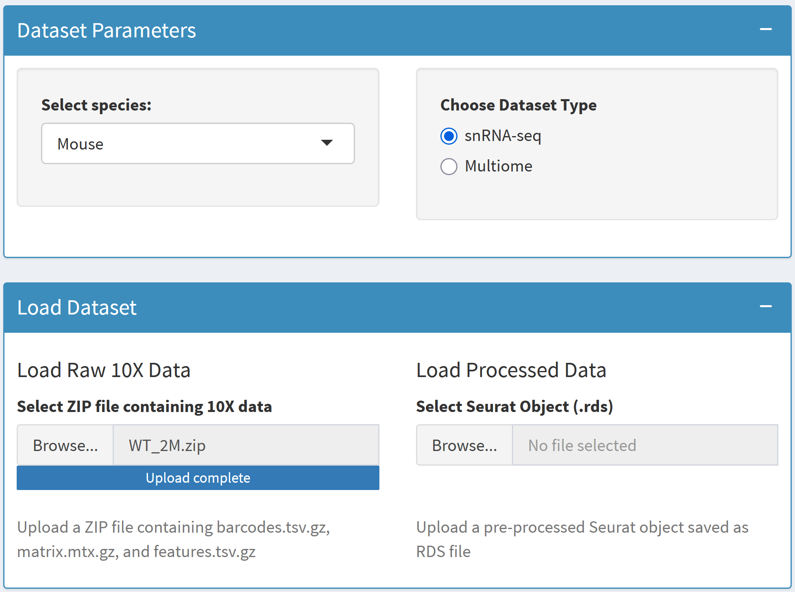

# Load Dataset

## Overview
This section allows you to load and initialize your single-cell RNA sequencing data for analysis.

## Data Types and Requirements



### Option 1: Raw 10X Genomics Data
Required files (compressed in a single `.zip`):
* `barcodes.tsv.gz`: Contains cell barcodes
* `matrix.mtx.gz`: Contains the expression matrix
* `features.tsv.gz`: Contains gene information

### Option 2: H5 Format
* Single `.h5` file containing the complete 10X dataset
* Faster loading than individual compressed files

### Option 3: Pre-processed Seurat Object
* Format: `.rds` file
* Requirements: Must be a valid Seurat object (version 4 or higher)

## Step-by-Step Process

1. **Select Species**: Choose your organism from the dropdown
2. **Choose Data Type**: Select snRNA-seq or Multiome based on your experiment
3. **Upload Data**: 
   - For new analysis: Upload ZIP or H5 file
   - For continuing analysis: Upload RDS file
4. **Wait for Processing**: The application will automatically validate and process your data

## What Happens After Upload

The application automatically:
- Validates file format and content
- Creates a Seurat object (for raw data)
- Initializes analysis parameters
- Displays dataset information (number of cells and genes)

```{tip}
Keep original files backed up before processing. Large datasets may take longer to load.
```

```{warning}
Common issues:
- Missing files in ZIP archive
- Corrupted .rds files  
- Incompatible Seurat object versions
- Memory limitations with very large datasets
```

## Supported File Formats

| Format | Description | Use Case |
|--------|-------------|----------|
| `.zip` | Compressed 10X files | Standard 10X Genomics output |
| `.h5` | HDF5 format | Faster loading, smaller file size |
| `.rds` | R data file | Pre-processed Seurat objects |

## Next Steps

Once your data is loaded successfully:
- Proceed to "Data Cleanup & Variable Features" for quality control
- Check the dataset summary information displayed
- Verify the number of cells and genes detected

## References
1. Hao et al., Dictionary learning for integrative, multimodal and scalable single-cell analysis. https://doi.org/10.1038/s41587-023-02100-3
2. https://satijalab.org/seurat/articles/get_started_v5_new