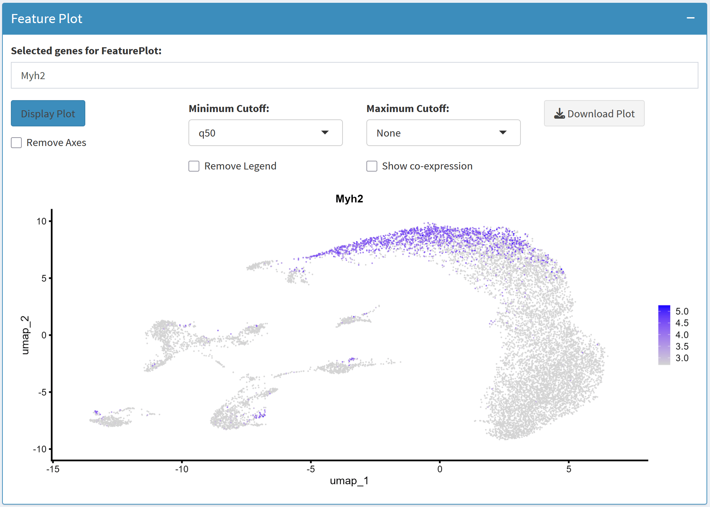
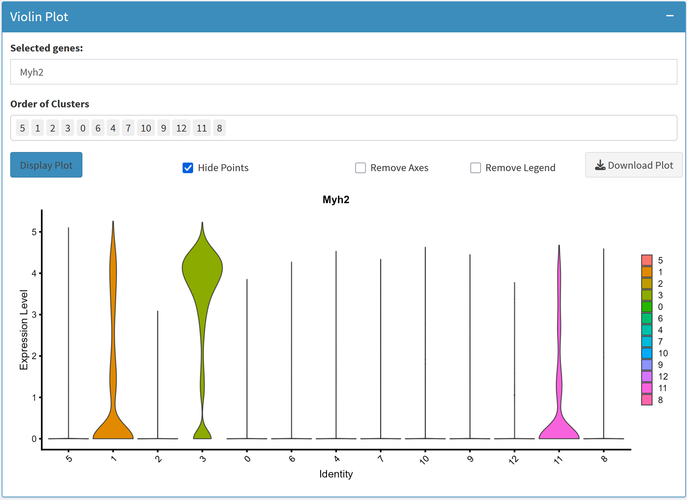
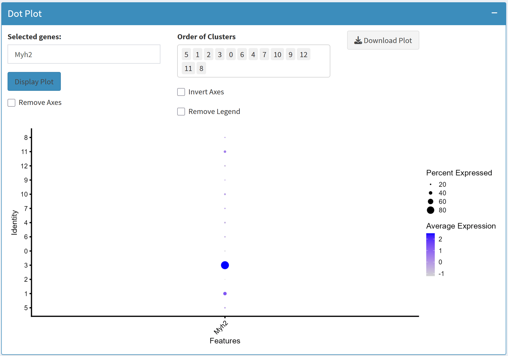
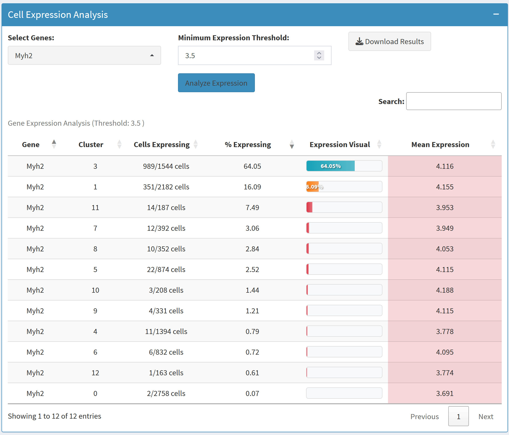

# Visualizing Marker Expression

## Overview
This section provides multiple visualization methods to explore gene expression patterns across your cell clusters. Understanding how genes are expressed spatially and across different cell populations is crucial for biological interpretation and cell type identification.

## Gene Selection System

### Global Gene Selector
**Main Gene Picker**
- Use the dropdown "Select Genes" to choose genes of interest
- Search functionality helps find specific genes quickly
- Multiple genes can be selected simultaneously
- **Auto-fill feature**: Selected genes automatically populate all plot sections below


### Manual Gene Entry
**Individual Plot Customization**
- Each plot type has its own text input field
- You can manually type gene names separated by commas
- Example: `Pax7, Myod1, Myog, Tnnt3`
- Manual entry overrides the global selection for that specific plot

### Assay Selection
**Choose Data Source**
- **RNA Assay**: Raw or normalized count data (most common)
- **Integrated Assay**: For multi-dataset analysis (if available)
- Different assays may show different expression patterns
- RNA assay recommended for most single-dataset analyses

## Visualization Methods

### Feature Plot
**When to use**: To see where your gene is expressed on the UMAP - which clusters and spatial regions show expression

**How to read**:
- Gray dots = cells not expressing the gene
- Colored dots = cells expressing the gene (darker color = higher expression)
- Shows you visually which clusters contain your marker genes

**Key Features:**
- **Co-expression option**: Shows multiple genes simultaneously to see overlapping expression
- **Cutoff controls**: Set thresholds to highlight only high-expressing cells
- **Display options**: Remove axes and legends for cleaner figures



### Violin Plot
**When to use**: To compare expression levels between clusters - see which clusters express your gene highest

**How to read**:
- X-axis = clusters, Y-axis = expression level
- Width of violin = how many cells at that expression level
- Wider sections = more cells with that expression level
- Points show individual cells (can be hidden)



**Configuration Options:**
- **Cluster selection**: Focus on specific clusters of interest
- **Point visibility**: Hide dots to see distribution shape more clearly
- **Cluster ordering**: Arrange clusters in your preferred order

### Dot Plot
**When to use**: To compare many genes across many clusters at once - perfect for checking multiple markers

**How to read**:
- **Dot size**: Bigger dots = higher percentage of cells expressing the gene
- **Dot color**: Darker color = higher average expression in expressing cells
- Each row = one gene, each column = one cluster
- Best for systematic marker comparison



**Settings:**
- **Cluster selection**: Include only clusters you want to compare
- **Axis inversion**: Put genes on Y-axis and clusters on X-axis
- **Display options**: Remove axes and legends for cleaner presentation

### Ridge Plot
**When to use**: Alternative to violin plot when you have many clusters - easier to see all distributions

**How to read**:
- Each "ridge" = one cluster's expression distribution
- Peak height = how many cells at that expression level
- Overlapping ridges help compare expression patterns between clusters
- Good for spotting bimodal expression (two peaks)


## Cell Expression Analysis

### Quantitative Gene Expression Summary
**Purpose**: Get precise numbers of cells expressing selected genes

**Configuration:**
- **Gene selection**: Use the picker or manual entry
- **Expression threshold**: Minimum expression level to count as "expressing"
- **Analysis scope**: Examines all selected genes across all clusters



**Analysis Output:**
- Table showing number and percentage of expressing cells per cluster
- Useful for quantifying marker gene specificity
- Export as CSV for further analysis or publication

**How to Use:**
1. Select genes of interest using the picker
2. Set appropriate expression threshold (default: 1)
3. Click "Analyze Expression" to generate summary table
4. Download results for documentation

```{tip}
Start with well-known marker genes for your cell types to validate that clusters make biological sense. The Feature Plot is excellent for initial exploration, while Dot Plot is perfect for comparing many markers systematically.
```

## Recommended Workflow

### Step 1: Initial Exploration
- Use Feature Plot with known marker genes
- Check if expression patterns match expected cell type locations
- Adjust cutoffs if needed to highlight specific populations

### Step 2: Systematic Comparison  
- Use Dot Plot to compare multiple markers across all clusters
- Identify cluster-specific expression patterns
- Note both positive and negative markers

### Step 3: Detailed Distribution
- Use Violin or Ridge plots for detailed expression distributions
- Examine expression variability within clusters
- Identify potential sub-populations

### Step 4: Quantification
- Use Cell Expression Analysis for precise percentages
- Document marker gene specificity for each cluster
- Export data for statistical analysis

```{warning}
Different visualization methods can give different impressions of the same data. Use multiple plot types to get a complete picture of gene expression patterns.
```

## Export Options

**Global Settings:**
- **Image format**: PNG, JPEG, TIFF, SVG, or PDF
- **Resolution (DPI)**: Adjust quality for presentations vs publications
- **Individual downloads**: Each plot type has its own download button

## Troubleshooting

**Gene not found?**
- Check spelling and capitalization
- Verify gene is present in your dataset
- Some genes may be filtered out during preprocessing

**No expression visible?**
- Gene may be lowly expressed - adjust cutoffs
- Check if gene passed quality filters
- Verify correct assay is selected

**Unexpected patterns?**
- May indicate batch effects or technical artifacts
- Cross-validate with known biology
- Consider examining multiple related genes